# 代理扩展
## 介绍

+ 代理扩展顾名思义就是在火狐浏览器的代理功能加上一些功能。
  
+ 代理扩展的页面和火狐浏览器的代理功能页差不多，你可以在开启“手动配置代理服务器”点击创建按钮进行创建手动代理服务器。

## 使用

### 安装

### 创建手动配置代理
+ 点击手动配置代理开关，然后再点击+号按钮进入手动配置代理列表。

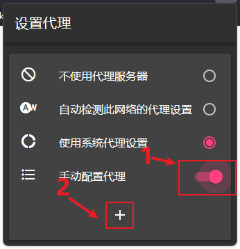

+ 在手动配置代理列表页面中点击右上角的+号按钮进入创建手动配置页面。 

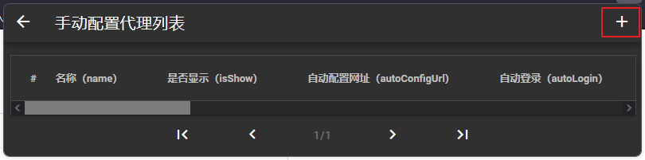

+ 在这里输入信息点击最底部的按钮，会弹框输入名字后点击OK即可创建成功。

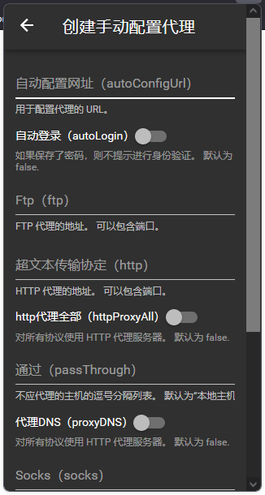

#### 创建一个Clash的代理配置
+ 输入配置信息。

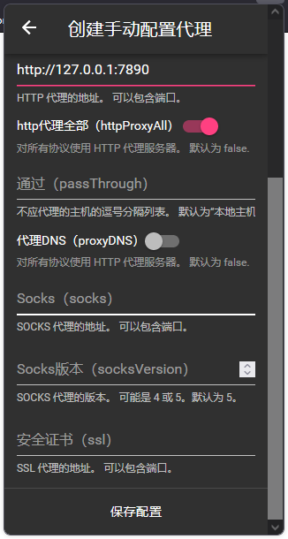

+ 点击保存配置按钮。

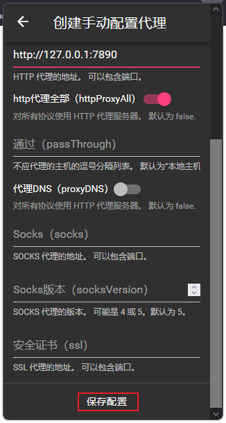

+ 点击OK按钮。

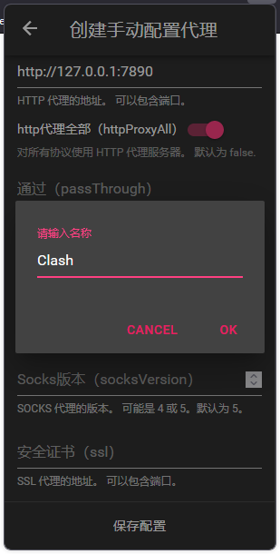

+ 完成。

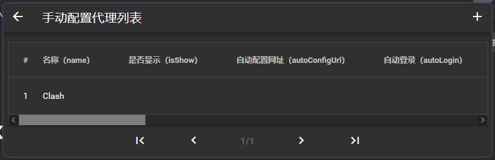

### 设置代理配置首页展示

**注意：** 代理配置最多只能展示5条。

+ 点击红框中的按钮，即可就配置显示到首页。

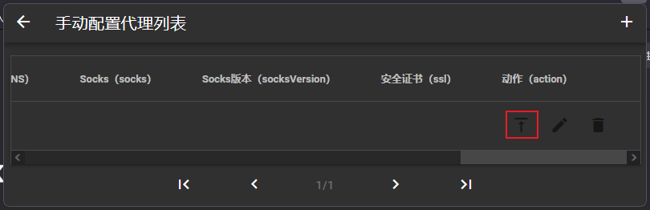

### 取消代理配置首页展示

+ 点击红框中的按钮，即可取消配置显示到首页。

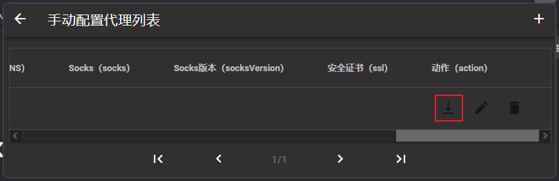

### 选择代理模式

+ 点击手动配置按钮开关，再选择代理配置。

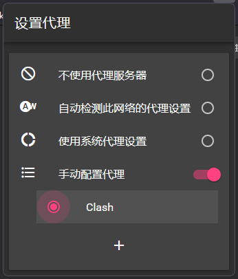

+ 完成。

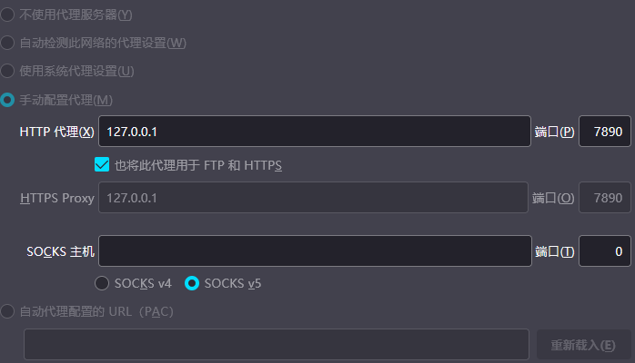

## 协议
```
                                 Apache License
                           Version 2.0, January 2004
                        http://www.apache.org/licenses/

   TERMS AND CONDITIONS FOR USE, REPRODUCTION, AND DISTRIBUTION
```