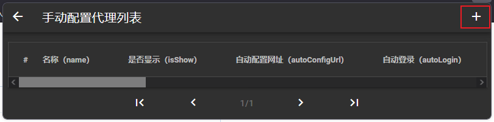

# پسوند پروکسی
## معرفی کنید

+ پسوند پروکسی، همانطور که از نام آن پیداست، افزودن برخی عملکردها به عملکرد پروکسی مرورگر فایرفاکس است.
  
+ صفحه پسوند پروکسی شبیه به صفحه عملکرد پروکسی مرورگر فایرفاکس است. پس از فعال کردن «پیکربندی دستی پروکسی سرور»، می‌توانید با کلیک بر روی دکمه «ایجاد» یک سرور پراکسی دستی ایجاد کنید.

## استفاده کنید

### نصب

#### نصب فایل محلی

+ در نوار جستجوی فایرفاکس تایپ کنید**about:addons**.


  
+ روی دکمه کلیک کنید تا نماد را در کادر قرمز تنظیم کنید، انتخاب کنید**افزونه نصب فایل...**.


### یک پروکسی پیکربندی دستی ایجاد کنید
+ روی سوئیچ پروکسی پیکربندی دستی کلیک کنید و سپس روی دکمه + کلیک کنید تا وارد لیست پروکسی پیکربندی دستی شوید.


+ در صفحه فهرست پروکسی پیکربندی دستی، روی دکمه + در گوشه سمت راست بالا کلیک کنید تا وارد صفحه ایجاد پیکربندی دستی شوید.



+ اطلاعات را در اینجا وارد کنید و روی دکمه در پایین کلیک کنید، یک کادر پاپ آپ برای وارد کردن نام ظاهر می شود و برای ایجاد موفقیت آمیز روی اوکی کلیک کنید.


#### یک پیکربندی پروکسی برای کلش ایجاد کنید
+ اطلاعات پیکربندی را وارد کنید


+ روی دکمه ذخیره پیکربندی کلیک کنید.


+ روی دکمه اوکی کلیک کنید.


+ پایان


### نمایش صفحه اصلی پیکربندی پروکسی را تنظیم کنید

**اطلاع：** پیکربندی پروکسی فقط می تواند حداکثر ۵ مورد را نمایش دهد.

+ روی دکمه در کادر قرمز کلیک کنید تا تنظیمات در صفحه اصلی نمایش داده شود.


### لغو نمایش صفحه اصلی پیکربندی پروکسی

+ برای لغو تنظیمات و نمایش آن در صفحه اصلی، روی دکمه در کادر قرمز کلیک کنید.


### حالت پروکسی را انتخاب کنید

+ روی دکمه تنظیمات دستی کلیک کنید و پیکربندی پروکسی را انتخاب کنید.


+ پایان


## پروتکل
```
                                 Apache License
                           Version 2.0, January 2004
                        http://www.apache.org/licenses/

   TERMS AND CONDITIONS FOR USE, REPRODUCTION, AND DISTRIBUTION
```
